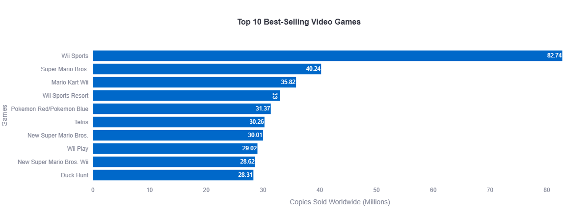
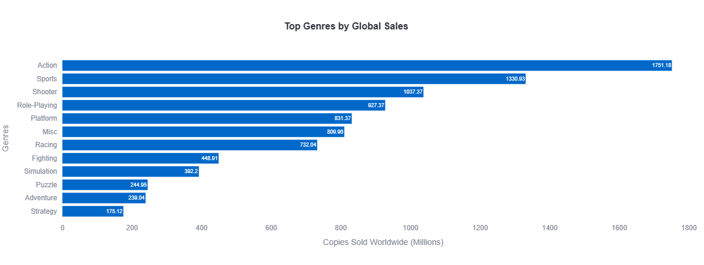
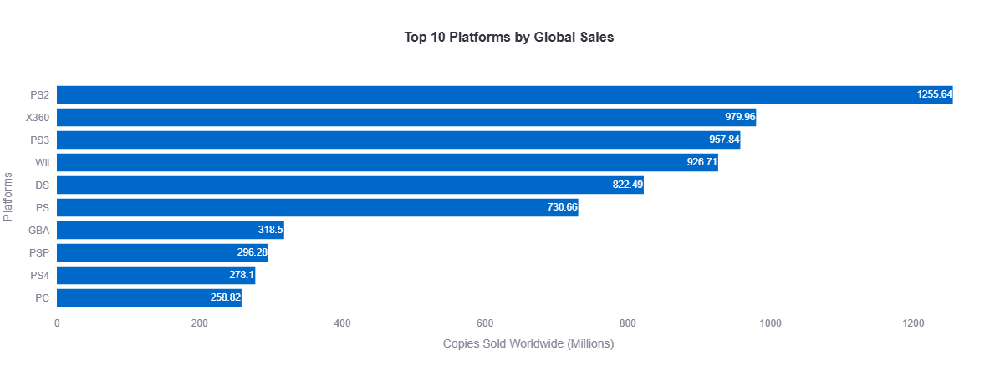
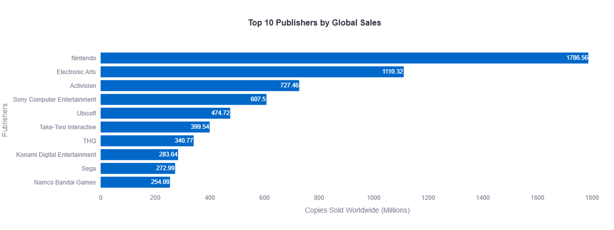
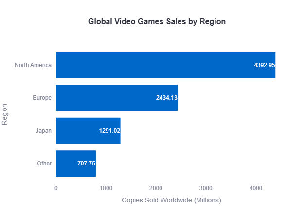
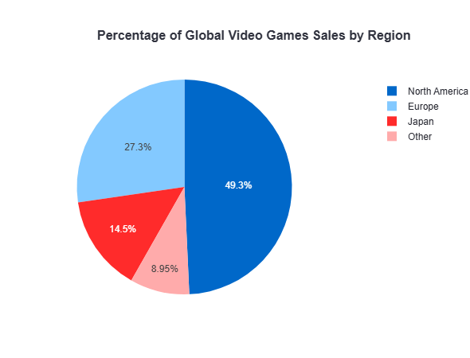
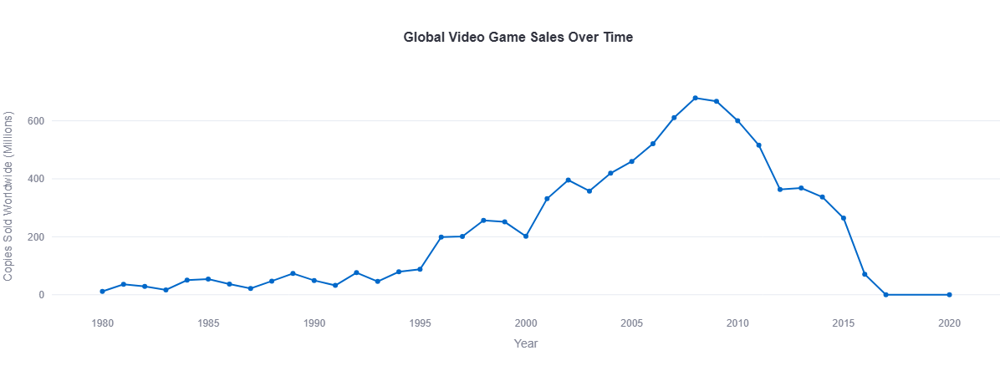
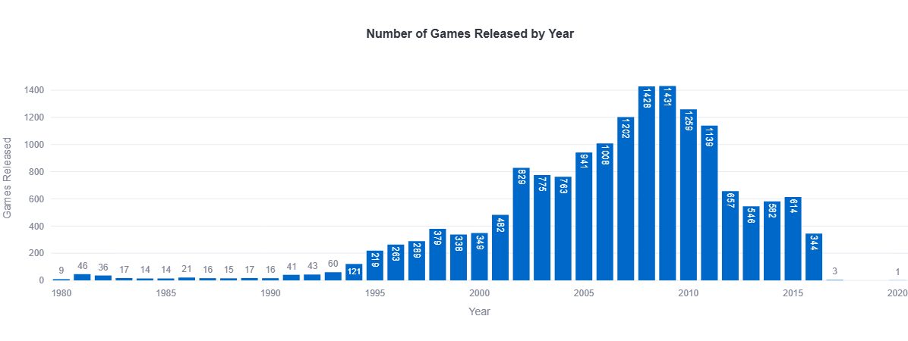

# Overview

This project is an opportunity to grow as a software engineer by turning raw data into a working analytics application. I am practicing Python data ingestion, cleaning, aggregation, and interactive dashboard design with Streamlit and Plotly, so I can learn how to build software that makes complex business questions easier to answer.

The dataset being analyzed is the "Video Game Sales" dataset, obtained from Kaggle. It contains historical sales information for video games with sales greater than 100000 copies sold. The dataset includes 16,598 records and provide information about video games, their platforms, genres, publishers, release years, and sales performance across different regions. Each row represent a single video game, while the columns describe characteristics of the game and its sales performance.

**Dataset Source**: [kaggle.com/datasets/gregorut/videogamesales](https://kaggle.com/datasets/gregorut/videogamesales)

**Description of the Data**

The dataset contains contains the following attributes:

- **Rank**: The ranking of the video game based on global sales
- **Name**: The title of the video game
- **Platform**: The gaming platform where the game was released (such as PlayStation, Xbox, Nintendo, PC, etc.)
- **Year**: The year the video game was released
- **Genre**: The category or type of game (such as Action, Sports, Shooter, Role-Playing, Strategy, etc.)
- **Publisher**: The company responsible for publishing the game
- **NA_Sales**: Sales generated in North America, measured in millions of copies
- **EU_Sales**: Sales generated in Europe, measured in millions of copies
- **JP_Sales**: Sales generated in Japan, measured in millions of copies
- **Other_Sales**: Sales generated in other regions of the world, measured in millions of copies
- **Global_Sales**: Total worldwide sales of each video game, measured in millions of copies

I wrote this software to explore the Video Game Sales dataset using a complete analytical pipeline. The app reads the dataset with Pandas, calculates metrics such as top titles, top genres, top platforms, top publishers, and regional sales totals, and visualizes those insights with Plotly charts inside a Streamlit dashboard.

The goal is to deepen my practical experience by building code that is easy to follow and that answers questions about historical video game performance across regions and release years.

# Data Analysis Results

**Question 1: Which are the top 10 best-selling video games worldwide?**

The top 10 best-selling video games are:

1. Wii Sports - 82.74 Millions copies sold
2. Super Mario Bros. - 40.24 Millions copies sold
3. Mario Kart Wii - 35.82 Millions copies sold
4. Wii Sports Resort - 33 Millions copies sold
5. Pokemon Red / Pokemon Blue - 31.37 Millions copies sold
6. Tetris - 30.26 Millions copies sold
7. New Super Mario Bros. - 30.01 Millions copies sold
8. Wii Play - 29.02 Millions copies sold
9. New Super Mario Bros. Wii - 28.62 Millions copies sold
10. Duck Hunt - 28.31 Millions copies sold

**Question 2: Which video game genre has sold the most games worldwide?**

Top Genre: Action
Copies Sold WorldWide: 1751.18 Millions

**Question 3: Which gaming platform has sold the most games worldwide?**

Top Gaming Platform: PS2
Copies Sold Worldwide: 1255.64 Millions

**Question 4: Which publisher has sold the most games worldwide?**

Top Publisher: Nintendo
Copies Sold Worldwide: 1786.56 Millions

**Question 5: How do total video game sales compare across regions?**

Total video game sales are highest in **North America**(49.3%), making it the largest market. **Europe**(27.3%) has the second-highest total sales, followed by **Japan**(14.5%) and **Others**(8.95%) regions. This indicates that North America contributed the largest share of global video game sales during the period covered by the dataset.

**Question 6: How have global video game sales changed over time?**

In the Video Game Sales dataset, global video game sales show a strong growth trend from 1980's until the late 2000's. 

In the early years of the dataset (1980's), annual global sales were relatively low compared to later periods. Sales increased progressively throughout the 1990's, with more significant growth occuring after 2000. The highest levels of total annual global sales occurred between 2007 and 2010, with 2008 representing the peak year for total global sales in the dataset. 

After 2009, the total yearly global sales values decreased. From 2010 onward, sales showed a downward trend, reaching substantially lower levels by 2016 compared with the peak period.

**Question 7: How many games were released each year?**

- 1980 - 9 games released
- 1981 - 46 games released
- 1982 - 36 games released
- 1983 - 17 games released
- 1984 - 14 games released
- 1985 - 14 games released
- 1986 - 21 games released
- 1987 - 16 games released
- 1988 - 15 games released
- 1989 - 17 games released
- 1990 - 16 games released
- 1991 - 41 games released
- 1992 - 43 games released
- 1993 - 60 games released
- 1994 - 121 games released
- 1995 - 219 games released
- 1996 - 263 games released
- 1997 - 289 games released
- 1998 - 379 games released
- 1999 - 338 games released
- 2000 - 349 games released
- 2001 - 482 games released
- 2002 - 829 games released
- 2003 - 775 games released
- 2004 - 763 games released
- 2005 - 941 games released
- 2006 - 1008 games released
- 2007 - 1202 games released
- 2008 - 1428 games released
- 2009 - 1431 games released
- 2010 - 1259 games released
- 2011 - 1139 games released
- 2012 - 657 games released
- 2013 - 546 games released
- 2014 - 582 games released
- 2015 - 614 games released
- 2016 - 344 games released
- 2017 - 3 games released
- 2018 - 0 game released
- 2019 - 0 game released
- 2020 - 1 game released

# Development Environment

I developed this software using Visual Studio Code with Git (v2.50.0) for version control

The programming language is Python (v3.14.6) with the following libraries:
- **Pandas**
- **Plotly**
- **Streamlit**

# Useful Websites

These resources helped me understand the libraries and patterns used in this project:
* [Pandas Documentation](https://pandas.pydata.org/docs/)
* [Plotly Express Documentation](https://plotly.com/python/plotly-express/)
* [Streamlit Documentation](https://docs.streamlit.io/)
* [Kaggle Dataset Page](https://www.kaggle.com/datasets/gregorut/videogamesales)

# Future Work

This project can be improved with:
* improved data cleaning so missing values are handled explicitly and the Year column is validated,
* interactive filters for users to explore genres, platforms, publishers, and time periods,
* a deployed Streamlit app so the dashboard can be shared and accessed from a browser.